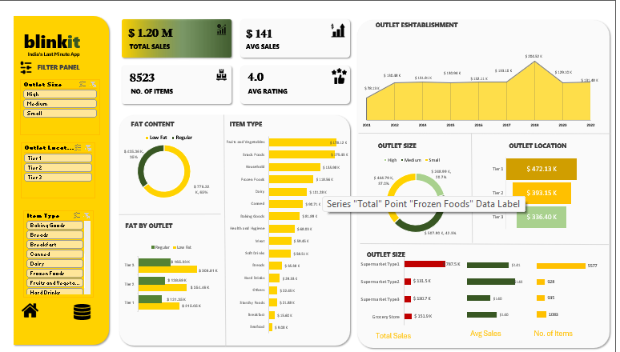

# 📊 BlinkIT Sales Analysis Dashboard

  <h3>Transforming Retail Sales Data into Actionable Business Insights</h3>

  Interactive Business Intelligence Dashboard developed using <b>Microsoft Excel</b> to analyze sales performance, customer behavior, outlet characteristics, product trends, and key business KPIs through dynamic visualizations and data-driven insights.

---

<b>Analyzing Retail Performance Through Interactive Business Intelligence.</b>

---

## 📌 Project Snapshot

| 🏷️ Attribute | 📌 Information |
|---------------|----------------|
| 📊 Project Type | Interactive Business Intelligence Dashboard |
| 🛠 Tool | Microsoft Excel |
| 📂 Dataset | BlinkIT Grocery Sales Dataset |
| 📈 Domain | Retail Sales Analytics |
| 🎯 Objective | Data-Driven Decision Making |
| 👩‍💻 Author | Garima Sharma |

---

## ✨ What You'll Explore

| 📊 Dashboard Features | 📈 Business Value |
|--------------|----------------------|
| Interactive Excel Dashboard | Sales Performance Analysis |
| Dynamic KPI Tracking | Customer Purchasing Behavior |
| Outlet Performance Comparison | Product Category Analysis |
| Interactive Slicers & Filters | Data-Driven Decision Making |

---

## 📖 Project Overview

Retail businesses generate massive volumes of transactional data every day. Transforming this data into meaningful business insights is essential for improving operational efficiency, understanding customer behavior, and making informed strategic decisions.

This project presents an **interactive Business Intelligence Dashboard** developed using **Microsoft Excel** to analyze BlinkIT's grocery sales data. By leveraging data cleaning, Pivot Tables, Pivot Charts, Slicers, and dashboard design principles, the dashboard enables users to explore sales performance, outlet characteristics, product distribution, and customer ratings through an intuitive and interactive interface.

Designed with a business-centric approach, the dashboard helps stakeholders monitor key performance indicators (KPIs), identify sales trends, compare outlet performance, and uncover actionable insights that support data-driven decision-making.

> 💡 **Key Outcome:** The dashboard transforms raw transactional data into an intuitive reporting solution that enables faster and more informed business decisions.
---

<i>"Data becomes valuable only when it helps people make better decisions."</i>

---
## 🎯 Business Problem

Retail organizations often manage thousands of sales transactions across multiple locations, product categories, and customer segments. Without a centralized analytical dashboard, identifying performance trends and making timely business decisions becomes challenging.

This project addresses that challenge by converting raw retail sales data into an interactive dashboard that enables users to:

- Monitor overall business performance.
- Compare sales across outlet locations and outlet sizes.
- Analyze customer purchasing behavior.
- Identify top-performing product categories.
- Track important business KPIs through interactive visualizations.
---

## 🚀 Project Objectives

- [x] Build an interactive Business Intelligence dashboard.
- [x] Analyze outlet performance across different locations.
- [x] Evaluate customer purchasing patterns.
- [x] Track critical business KPIs through interactive visualizations.
- [x] Enable interactive exploration through slicers.
- [x] Support data-driven business decisions.
---

